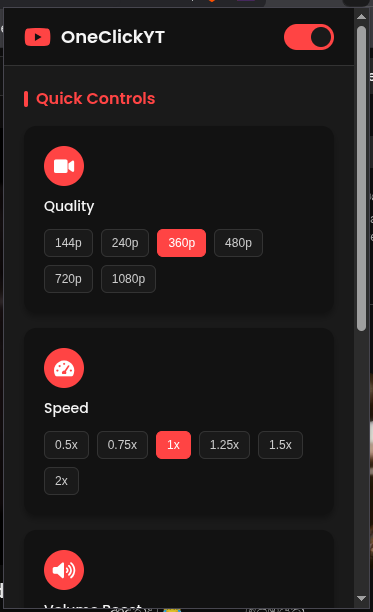

# YouTube Enhancer 🎥

A browser extension to **control YouTube video quality, speed, and more with one click**!

---

## ✨ Features
- **One-click quality change** (144p to 4K)
- **Adjust playback speed** (0.5x to 2x)
- **Volume boost** (up to 200%)
- **Picture-in-Picture (PiP) mode**
- **Theater mode toggle**
- **Dark/light theme support**

---

## 🖥️ Screenshots
| Popup UI | Quality Selector | Speed Control |
|----------|------------------|---------------|
|  |  |  |

*(Replace with your actual screenshot paths)*

---

## 🛠 Installation
### Chrome/Edge/Brave
1. Download this repo
2. Go to `chrome://extensions`
3. Enable **Developer mode**
4. Click **Load unpacked** and select the extension folder

---

## 🏗 Project Structure

---

## ❓ FAQ
### Why isn't quality changing?
YouTube's API sometimes restricts programmatic quality changes. Try:
1. Refresh the page
2. Manually set quality once before using the extension

### How to skip ads?
Enable "Skip Ads" in the popup (experimental).

---

## 🤝 Contributing
1. Fork the repo
2. Create a branch (`git checkout -b feature/xyz`)
3. Commit changes (`git commit -m 'Add feature'`)
4. Push (`git push origin feature/xyz`)
5. Open a PR

---

## 📜 License
MIT © [Your Name](https://github.com/uditha1994)

---

⭐ **Star this repo if you find it useful!** ⭐
